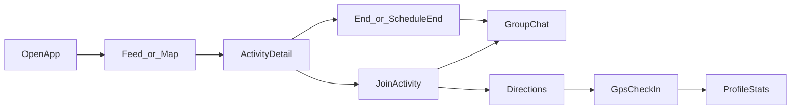
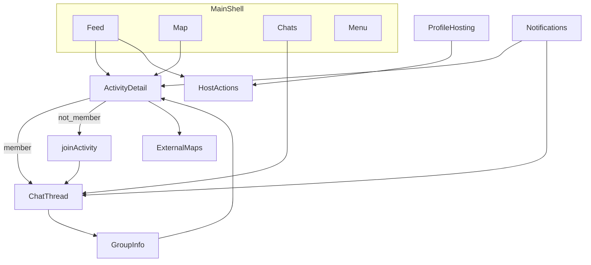

# MeetRadius — Product flows & connectivity

This document describes how screens and features should connect for a **solid end-to-end experience**. It complements [PRODUCT_MVP.md](PRODUCT_MVP.md) (scope and principles) and reflects the current codebase plus recommended next steps.

---

## Target user loop

The MVP promise: open the app → see nearby activities → join → coordinate in chat → show up → check in → build streak/stats on profile.



---

## What exists today

| Area | Status | Notes |
|------|--------|--------|
| Auth | Done | `AuthGate` → `HomeFeedScreen` |
| Main shell | Done | Feed, Map, Chats, Menu |
| Host activity | Done | Multi-step post to Firestore |
| Feed / map discovery | Done | `watchActivities()`, category chips, live vs upcoming |
| Join / leave | Done | `joinActivity`, `leaveActivity` (host cannot leave) |
| Activity detail | Done | Host, facts, members, location preview |
| Host manage | Done | End, edit, delete via bottom sheet |
| Scheduled end | Done | `endsAt`, client filter, `syncDueHostedActivities` |
| Group chat | Done | Per-activity thread, system events (left / ended) |
| Profile hosting | Done | Hosted list with Live / Upcoming / Ended |
| Open in maps | Done | Google / Apple directions from coordinates |
| Notifications | Placeholder | Empty inbox UI |
| Check-in | Not built | Spec’d in MVP, no GPS verify yet |
| Report / block | Partial | UI stubs; report not wired to backend |
| Friends attending | Placeholder | Copy on cards only |
| Push notifications | Not built | — |
| Cloud Function auto-end | Not built | Client sync on feed open only |

---

## Activity lifecycle (data model)

| Field | Meaning |
|-------|---------|
| `startsAt` | When the meetup starts |
| `endsAt` | Optional scheduled stop (host intent) |
| `endedAt` | Actual stop (manual end or auto sync after `endsAt`) |
| `isLive` | Discovery emphasis (live vs upcoming) |
| `memberIds` | Who can access chat |

**Rules (app logic):**

- **Discoverable** (feed + map): `endedAt == null` and (`endsAt == null` or `now < endsAt`).
- **Over**: `endedAt != null` or past `endsAt`.
- **Join allowed**: discoverable and not full.
- **Manual end**: host → `endActivity()` → sets `endedAt`, hides from feed/map, chat stays.
- **Delete**: removes document everywhere.

---

## Flows to connect (priority order)

### 1. Join → chat (highest ROI)

**Problem:** After joining, users may not realize a group chat exists or how to open it.

**Target behavior:**

1. User taps **Join** on feed, map detail, or activity detail.
2. SnackBar: “You’re in!” with action **Open chat**.
3. Activity detail shows **Open chat** as primary CTA when `memberIds` contains current user.
4. Optional: switch to Chats tab with thread focused.

**Touchpoints:**

- `feed_body.dart` — `_tryJoinActivity`
- `feed_activity_detail_screen.dart` — bottom actions
- `activity_map_screen.dart` — via shared detail / hub helper

**Suggested helper:**

```dart
// e.g. lib/features/activity/presentation/open_activity_hub.dart
void openActivityHub(BuildContext context, {
  required Activity activity,
  required String activityTitle,
});
// → detail if not member; chat if member; join if discoverable
```

---

### 2. Ended activity UX in chat

**Problem:** After end (manual or scheduled), members can still try to chat without context.

**Target behavior:**

- Thread stays visible in Chats with **Ended** label (partially done in chats hub).
- Composer disabled or hidden; banner: “This activity has ended.”
- System line already posted on end (`apply_activity_end.dart`).

**Touchpoints:**

- `activity_chat_thread_screen.dart`
- `watchActivityById` stream for `isOver` / `isEnded`

---

### 3. Check-in (MVP core — not implemented)

**Problem:** Profile streaks/stats and “real-world” promise depend on proof of attendance.

**Target behavior:**

1. During live window (e.g. from `startsAt` until `endsAt` / `endedAt`), show **Check in** on detail and/or chat.
2. Verify user within geofence of activity pin (~100–200 m).
3. Write `checkedInMemberIds` or `checkIns/{uid}` on activity doc.
4. Host sees who checked in; profile increments **completed** / streak.

**Touchpoints:**

- New: `lib/features/activity/data/check_in_activity.dart`
- `feed_activity_detail_screen.dart`, `activity_chat_thread_screen.dart`
- `profile_screen.dart` — stats from check-ins

**Dependencies:** `geolocator` (or similar), location permission copy in settings.

---

### 4. Notifications inbox + deep links

**Problem:** Bell icon opens an empty screen; no pull back into activities.

**Target behavior (phase 1 — in-app only):**

| Event | Recipient | Tap opens |
|-------|-----------|-----------|
| New join | Host | Activity detail or members |
| New chat message | Members (not muted) | Chat thread |
| Starting soon | Members | Activity detail |
| Activity ended | Members | Chat (read-only) |

**Phase 2:** FCM push with same payloads.

**Touchpoints:**

- `notifications_screen.dart` — Firestore `users/{uid}/notifications`
- `send_activity_message.dart`, `join_activity.dart` — write notification docs
- Shared route: `activityId` + optional `openChat: true`

---

### 5. Report & block (trust)

**Problem:** Group info says report is not wired; blocks may not filter discovery.

**Target behavior:**

- **Report** → `reports` collection + confirmation UI.
- **Block user** → `users/{uid}/blockedUids`; filter activities/chats involving blocked users.
- **Mute chat** → per-thread flag; skip notification writes.

**Touchpoints:**

- `activity_group_info_screen.dart`
- `watch_activities.dart`, `watch_my_chat_threads.dart` — client filter
- `blocked_users_screen.dart` — already in settings

---

### 6. Discovery anchor (feed + map)

**Problem:** Feed/map may not rank by real distance; copy can say “15 mi” without matching logic.

**Target behavior:**

- Settings: GPS on **or** manual city / anchor.
- Sort: distance → live → upcoming start time.
- Map: center on user; same filter chips as feed where possible.

**Touchpoints:**

- Settings location section
- `watch_activities.dart` — sort after fetch
- `activity_map_screen.dart` — initial center from anchor

---

### 7. Profile: joined activities

**Problem:** Profile emphasizes **hosting**; joiners have no home for “what I’m going to.”

**Target behavior:**

- Tab or section: **Joined** (`memberIds` contains me, not host).
- Rows: Open chat, directions, check-in when applicable.
- Stats: hosted / joined / checked-in.

**Touchpoints:**

- `profile_screen.dart`
- New stream: `watchJoinedActivities(uid)`

---

### 8. Friends attending (or honest MVP)

**Option A:** Wire lightweight friends (shared joins / explicit friend list) → show names on cards.

**Option B:** Remove placeholder copy until V2.

**Touchpoints:**

- `live_activity_card.dart`, `upcoming_activity_card.dart`
- `feed_body.dart` — `friendNamesLine`

---

### 9. Invite deep link

**Target behavior:** Invite URL opens app → activity detail → join (or chat if already member).

**Touchpoints:**

- `lib/features/invite/`
- App links / Firebase Dynamic Links (or custom scheme)

---

### 10. Server scheduled end (production)

**Target behavior:** Cloud Function every 1–5 min ends activities where `endsAt <= now` and `endedAt == null`, using same fields as `apply_activity_end.dart`.

**Why:** Client `syncDueHostedActivities` only runs when host opens feed; not exact time.

---

## Cross-tab navigation map



---

## Screen entry points (reference)

| Screen | File | Primary actions |
|--------|------|-----------------|
| Feed | `feed_body.dart` | Join, leave, manage own, open detail |
| Map | `activity_map_screen.dart` | Pin → detail |
| Activity detail | `feed_activity_detail_screen.dart` | Join, members, host ⋮ |
| Host sheet | `host_activity_actions_sheet.dart` | End, edit, delete |
| Chat thread | `activity_chat_thread_screen.dart` | Messages, group info |
| Group info | `activity_group_info_screen.dart` | Report, mute, members, maps |
| Chats hub | `chats_hub_screen.dart` | Open thread |
| Profile | `profile_screen.dart` | Hosting list, manage |
| Post activity | `host_activity_screen.dart` | Create with `startsAt` / `endsAt` |

---

## Recommended implementation phases

### Phase A — Glue (1–2 weeks)

- [x] `openActivityHub` helper
- [x] Join success → Open chat
- [x] Detail CTAs by membership state
- [x] Ended chat: disable composer + banner

### Phase B — MVP core (2–4 weeks)

- [x] Check-in + geofence
- [x] Profile joined tab + basic stats
- [x] Notifications Firestore inbox + deep links
- [x] Report write path + block filters

### Phase C — Polish (ongoing)

- [x] Discovery anchor + distance sort
- [x] Friends attending or remove placeholders
- [x] Invite deep links
- [x] Cloud Function for `endsAt`
- [x] FCM push

---

## Testing checklist (manual)

Use this after connecting flows:

1. Post live activity with scheduled end in 10 minutes → appears on feed and map.
2. Second user joins → can open chat from SnackBar / detail.
3. Host ends early → disappears from feed/map; chat shows ended state; join blocked.
4. Wait past `endsAt` → host opens feed → activity ended in Firestore; same UX as manual end.
5. Blocked user does not see host’s activities (after block flow exists).
6. Check-in only works near pin (after check-in exists).

---

## Related files

| Topic | Location |
|-------|----------|
| MVP scope | [PRODUCT_MVP.md](PRODUCT_MVP.md) |
| Activity end | `lib/features/activity/data/end_activity.dart` |
| Scheduled end | `lib/features/activity/domain/activity_schedule.dart` |
| Firestore rules | [firebase/firestore.rules](../firebase/firestore.rules) |
| Main navigation | `lib/features/feed/presentation/home_feed_screen.dart` |

---

*Last updated to reflect activity end / scheduled end implementation and planned connectivity work.*
