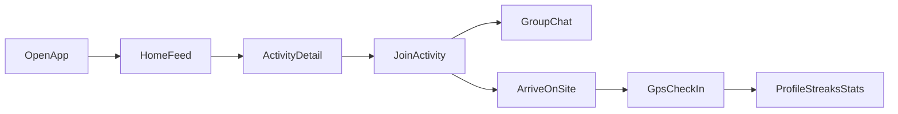

# MeetRadius — MVP product specification

**One-line promise:** Open the app and immediately see real-world activities happening near you—sports, coffee, hikes, golf, social events, support groups, and spontaneous local hangs. The product is **activity-first**: people meet through what they do, not through endless feeds or random DMs.

This document is product and UX focused. It does not prescribe backend architecture or specific SDKs.

---

## Product principles

**The app should feel:**

- **Local** — What you see is grounded in where you are (GPS) or a **single** manual anchor (city + ZIP). Broader “travel browse” is V2.
- **Active** — The interface rewards movement and showing up, not passive scrolling.
- **Simple** — Few decisions per screen; no clutter.
- **Fast** — From launch to “something I could join” in seconds.
- **Community-driven** — Small groups, real meetups, credibility from participation—not follower counts.
- **Real-world focused** — The goal is leaving the app to do something with others.

**Explicitly not the vibe:**

- Corporate or overly polished “enterprise social” energy.
- Dating-app framing, swipe-heavy discovery, or profile-as-showcase.
- Complicated onboarding or dense settings before value.
- Social-media-style endless messaging and engagement loops.

---

## MVP scope

### Build first (MVP)

These items form the **core loop** for v1. Everything else waits.

1. **Home feed** — Activity cards combining **live** and **upcoming** activities, sorted for urgency and relevance.
2. **Create an activity (host flow)** — Enough structure to post time, place, type, capacity, and basic details so others can join.
3. **Join an activity + group chat** — Joining unlocks a **single lightweight group thread** for that activity only.
4. **GPS check-in** — Participants confirm physical presence at the activity location; hosts get useful arrival signals.
5. **Basic profile** — Minimal identity plus **weekly activity streak** and **simple activity stats** (e.g. joined / completed). Detailed **badge visuals** wait until V2 (see below); the app can still **record** milestone progress in data if useful for a later drop.
6. **Report / block user** — Clear, calm safety paths without making the app feel paranoid. **MVP relies on manual reporting and human review**—not automated moderation (V2).

### Hold for V2 (explicit deferrals)

Ship the core loop first; add these once v1 is stable:

- **Badges** — Users **earn** milestones and category credibility over time, but the **full visual system** (rich badge strip on profile, participant-list badges, illustrated tiers, celebrations) ships in **V2**. MVP may show **plain stats** only.
- **Travel mode** — Browsing another city’s feed while not physically there. MVP sticks to a **single discovery anchor** (GPS and/or manual city + ZIP).
- **AI moderation** — **MVP:** manual report flows + block + human review. **V2:** AI-assisted triage and proactive flags (harassment, spam, inappropriate media) as **assist** to humans, not a replacement.
- **Map view** — In-app map surface for discovery (pins, clusters, map tab). MVP is **feed-first**; distance and place names on cards plus **“open in maps”** for directions is enough for many users until V2.

### Hold for later (not MVP)

Examples of what to **defer** so the first version stays shippable:

- Open social graph, friend suggestions at scale, or “follow” mechanics beyond what’s needed for “friends attending.”
- Direct messages between users who are **not** in the same joined activity.
- Heavy recommendation engines, infinite personalization, or complex ranking beyond live-first + upcoming + distance.
- Rich profiles (multi-photo galleries, bios-as-feeds, links, stories).
- Advanced host tooling (ticketing, paid events, recurring series management) unless trivially simple.
- Full admin dashboards; start with reports + blocks + basic review workflow assumptions.

---

## Core user loop

Ideal narrative: a user opens the app, scans a **prioritized feed** of nearby activities, taps one that feels doable, **joins**, uses **group chat** only for practical coordination, travels to the spot, **checks in** with one tap, and leaves with **streak / stats** updated on a **minimal profile** (rich **badges UI** is V2).

---

## Home feed experience

The home feed is the **most important screen**.

**Primary job:** Answer immediately: “What could I do with people near me, soon?”

**Sort and priority (MVP-level):**

1. **Live activities** — Highest priority; should read as “happening now or imminently.”
2. **Upcoming activities** — Next by start time and proximity, still within the product’s discovery radius rules.

**Example card headlines (copy style, not final strings):**

- “Need 2 basketball players right now” (live / urgent)
- “Coffee meetup in 20 minutes”
- “Hiking Saturday morning”
- “Basketball tonight — 2 spots left”

**Emotional goals for the feed:**

- **Active and alive** — Motion, freshness, and time sensitivity are obvious at a glance.
- **Urgent where appropriate** — Live rows should create a gentle “I could join this now” pull.
- **Local** — Distance and place context are visible without overwhelming the card.

---

## Live activities

**Concept:** Live activities are **spontaneous or imminent** meetups—MVP should treat them as a first-class state (e.g. starting within about **one hour**, and/or explicitly marked live by the host; exact rules can stay **TBD** in Appendix).

**UX goals:**

- Visually **distinct** from upcoming cards: stronger hierarchy, clear LIVE treatment, optional countdown or “starts in X min.”
- Copy and layout should reinforce: **“I should consider joining this now.”**

**UI ideas (guidance, not a pixel spec):**

- Prominent LIVE badge or pill; optional subtle emphasis (e.g. glow or accent) that still feels modern, not gimmicky.
- Timer or countdown where it reduces ambiguity.
- Slightly brighter accent or border system than standard cards—enough to scan quickly, not enough to feel chaotic.

---

## Activity cards

Each card should stay **simple and scannable** so users can browse quickly.

**Recommended visible fields (MVP):**

- **Activity type** (sport, coffee, hike, golf, social, support, spontaneous/other).
- **Headline / title** — Short, human, specific.
- **Start time** — Absolute and/or relative (“in 20 min,” “Sat 9am”).
- **Distance** — From the user’s current discovery anchor (GPS and/or manual city + ZIP; no Travel Mode until V2).
- **Participants** — Count and/or capacity (“4/8”).
- **Friends attending** — When applicable, names (see next section).
- **Live indicator** — Clear when the activity is in the live state.

**Interaction goal:** Fast browse → tap for detail → join or bail with minimal friction.

---

## Friends attending

If people the user knows (per whatever lightweight “friend” or connection model exists for MVP) are going, show **exactly which friends**—for example: “Alex, Jordan.”

**Why it matters:** Named friends reduce anxiety about walking into a stranger-only room; it supports the community, real-world positioning.

**Edge cases (MVP guidance):**

- **No friends attending** — Omit the row or show a neutral state; do not shame empty social graphs.
- **Privacy later** — Optional post-MVP control: hide my attendance from non-joiners; MVP can default to “visible to friends when browsing” if that keeps scope small.

---

## Messaging system

**Hard rule:** Users can only message in the context of an activity they have **joined**. No random DMs.

**Per activity:**

- One **group chat** (or single thread) for lightweight pre-event coordination: time tweaks, exact meeting pin, “running 5 late,” etc.

**Tone and UX:**

- **Temporary and utility-first** — Chat exists to make the meetup work, not to replace other messengers.
- **Clean** — Avoid social-media flourishes (stories, reactions overload, algorithmic sorting) in MVP.

---

## Activity streaks and badges

Framed as **community credibility** more than arcade gaming.

**Streaks (MVP)**

- **Weekly activity streak** — Plain-language MVP definition: user earns streak progress when they **check in** to joined activities within the product’s week boundary (exact calendar rule **TBD**); streak displays on profile and optionally next to name in participant lists.

**Badges (V2 for full visuals; earning rules can be defined early)**

- **MVP:** Optional **plain stats** only (e.g. completed count)—no obligation to ship illustrated milestone chips or category badge rows on profile or in lists.
- **V2 — full visual system:** Participation milestones (e.g. **25 / 50 / 100** completed activities; definitions tied to successful check-in **TBD**) and category flavor badges (**Sports**, **Outdoor**, **Social**, etc.) with deliberate layout on **profile**, **participant lists**, and activity detail—compact, adult, not childish.
- **Tone (when badges ship):** Rewarding and calm—more “this person shows up” than “level up warrior.”

---

## Profile design

Profiles stay **minimal**.

**MVP fields / modules**

- **First name** (display name).
- **One profile photo**.
- **Streak** — Clear weekly streak indicator.
- **Activity stats** — Simple counts (e.g. joined / completed); exact stat set **TBD**. **Badge strip / milestone art — V2** (see Hold for V2).

**Non-goals**

- Not Instagram (no multi-tap galleries, no aesthetic grid).
- Not Tinder (no swipe deck, no romantic positioning).

---

## Check-in experience

**Purpose:** Prove physical attendance and power **streaks** (and future **badge** rules in data, if recorded) / host confidence.

**UX goals:**

- **Simple** — Ideally one primary action when the user is in range and within the allowed time window.
- **Satisfying** — Clear confirmation; optional subtle positive feedback without noisy gamification.
- **Host visibility** — Host gets notified (or in-app signal) when participants check in; exact channel **TBD** (push vs in-app only).

**MVP assumption:** GPS-based proximity to the activity’s defined location, with clear error states (“too far,” “too early,” “already checked in”).

---

## Safety and moderation

Strong but **calm** safety flows—users should feel protected, not surveilled.

**User-facing actions (MVP)**

- **Report user**
- **Report activity**
- **Report messages** in activity chat
- **Block** (paired with report where appropriate)

**Moderation automation (V2)**

- **Not MVP.** After manual workflows are stable, add **AI-assisted** triage as **assist** to humans: flag harassment, offensive text, inappropriate photos, spam-like patterns—never the sole enforcement layer. Human review SLAs remain **TBD**.

**UX principle:** Safety is always reachable in-context (chat overflow, profile overflow, activity overflow) with short forms and clear outcomes (“Thanks, we’ll review”).

---

## Location and discovery

**Discovery radius**

- **Maximum activity radius: 15 miles** from the user’s **current discovery anchor** (single anchor in MVP—see below).

**Location inputs (MVP)**

- **GPS** — Default for “near me now.”
- **Manual city + ZIP** — For users who prefer not to share precise location continuously or for quick setup.

**Travel Mode (V2)**

- Deferred: user **browses activities in another city** while traveling, with clear copy so hosts are not misled about physical presence. MVP does not ship a separate “travel browse” mode; revisit when map + feed polish allow it.

**Experience goals:** Seamless, lightweight, and honest about what location is used for (ranking, distance, check-in). **Map view** for in-app discovery is **V2** (see Hold for V2); deep-linking to system maps for directions remains compatible with MVP.

---

## Overall visual and UX direction

**Should feel**

- Modern and clean
- Approachable
- Slightly energetic (motion and accent used sparingly)
- Community-focused

**Likely design system direction**

- Darker overall UI with restrained contrast
- Clean cards with strong typography hierarchy
- Simple navigation model (few tabs / few primary destinations)
- Minimal clutter—prefer progressive disclosure in detail screens over dense home rows

**North star:** Encourage **real-world movement and connection**, not in-app engagement tricks.

---

## Appendix — open product questions (TBD)

Document honest gaps so implementation conversations stay grounded.

- Exact **live window** (e.g. strict 60 minutes vs host toggle vs both).
- Whether **check-in** is the only event that increments streaks (and future **badge** milestones), or join + no-show rules matter.
- **Host verification** and abuse prevention for fake locations or spam activities.
- **Age gating** and any legal copy for activities involving minors or sensitive support groups.
- **Friend graph** source for MVP (contacts, invites, mutuals) and minimum viable privacy controls.
- **Push notification** scope for hosts vs participants (check-in, chat, live nearby alerts).
- **Content policy** specifics and region-specific legal requirements.

---

## Document control

| Version | Date       | Notes                    |
| ------- | ---------- | ------------------------ |
| 0.1     | 2026-05-11 | Initial MVP product spec |
| 0.2     | 2026-05-11 | Hold for V2: badges UI, Travel mode, AI moderation, map view; MVP profile/safety/location tightened |
